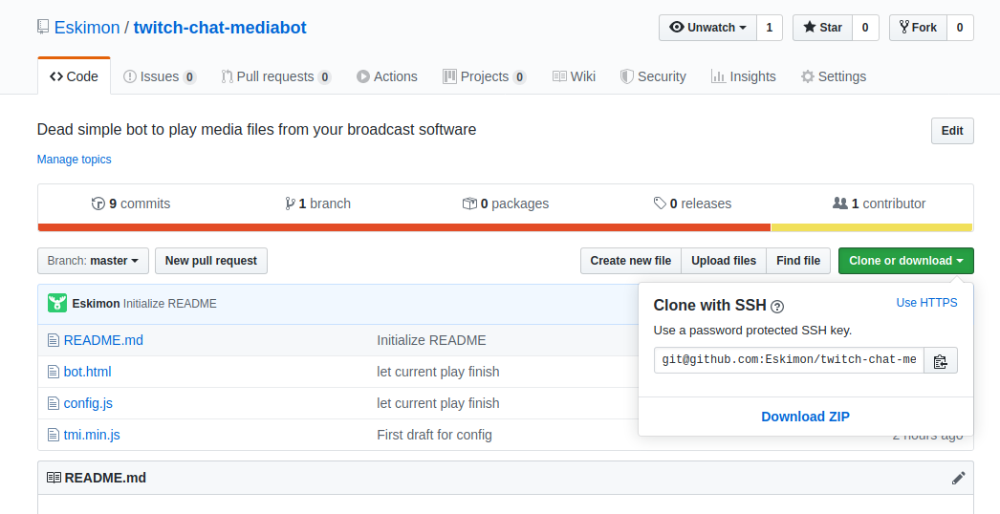

# Installation

Start by downloading the toolset by clicking the "Download Zip" button

Unzip it somewhere you will remember and you are good to go!

Now, two things to do: Add the tool in your streaming tool, and configure the bot.

## OBS

..TO DO..

# Configuration

..TO DO..

# Wanna thank me?

You like this tool? You wanna thank me? Buy me a beer or some coffee!

Also, you can find me on [Twitter](https://twitter.com/Eskimon_fr), [Twitch](https://twitch.tv/eskimon), or [my very own blog](https://eskimon.fr)!
